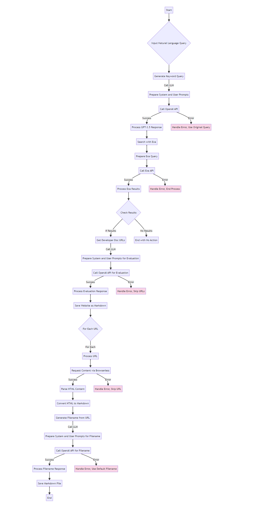

# Cursor Knowledge Builder

### Description

Knowledge Builder is a Python tool designed to automate the collection of developer documentation from the internet. By leveraging language models and web scraping technologies, it refines user queries into keyword searches, fetches relevant documentation URLs, and saves the content as markdown files in a local directory. This tool is for makers and developers looking to consolidate and access documentation offline or within their own projects.



Refines natural language queries into concise keyword queries suitable for search engines using GPT-3.5-turbo.
Searches the internet using the Exa search engine to find relevant developer documentation.
Evaluates the quality of search results using GPT-3.5-turbo to identify high-quality, reliable, and relevant developer documentation.
Scrapes the content of the identified developer documentation websites using Browserless.
Parses the HTML content to retain text and code blocks using BeautifulSoup.
Generates descriptive filenames for the Markdown files based on the URL using GPT-3.5-turbo.
Saves the parsed content as Markdown files in the "cursor-knowledge" folder.


### Use

These knowledge folders can then be imported into Cursor depending on whatever context you want Cursor to have access to in your workspace. Once imported, autoindex will take care of the chunking and RAG, in that Cursor will be able to use the knowledge to answer questions about the developer docs and to help write code based on relevant retrieved snippets.


### Requirements

You will need an Exa API key, a Browserless API key, and an OpenAI API key. Exa and Browserless currently offer a free tier, but OpenAI requires paid API credits. You can switch out OpenAI with Ollama, LM Studio, Anthropic, Together AI, or any other llm.
Install the program by cloning the repo, installing a virtual environment, activating it, and running the following command:

```
pip install -r requirements.txt
```

Add the api keys to your .env file:

```
OPENAI_API_KEY=your_openai_api_key
EXA_API_KEY=your_exa_api_key
BROWSERLESS_API_KEY=your_browserless_api_key
```

 and then you can search and save developer docs locally. Once you've installed the program, import the folder into cursor, add `env/` to the cursorignore file and you can start the script by clicking the play button in the top right corner of the open file or running the following command into your terminal once you've activated your virtual environment:
 
```
python knowledgebuilder_0.1.6.py
```

  Be sure to set the API keys in the .env file, and to set the environment in the Cursor. 

### Customization

You can adjust the number of search results to retrieve by modifying the num_results parameter in the search_with_exa function call in the main function, or switch out chat models.

If you want to change the folder where the Markdown files are saved, modify the folder_path variable in the save_website_as_markdown function.

### License

This project is licensed under the MIT License.

### Acknowledgements
OpenAI for providing the GPT-3.5-turbo language model.
Exa for the search engine functionality.
Browserless for web scraping capabilities.
BeautifulSoup for HTML parsing.
Feel free to customize and enhance the script based on your specific requirements!
